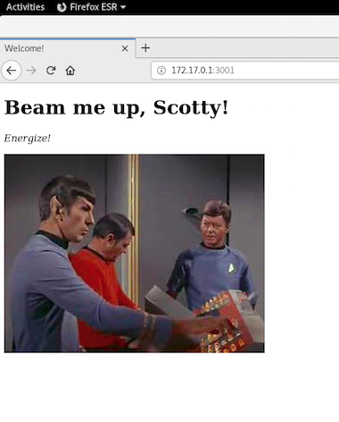
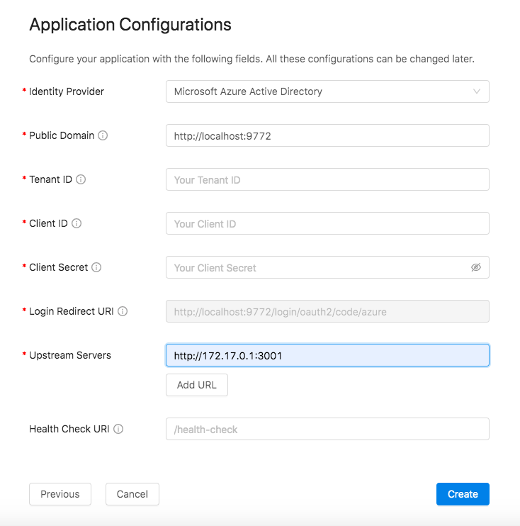
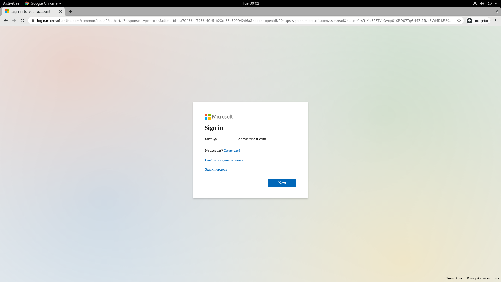

# How to secure our applications using the Datawiza Access Broker 

This tutorial will show you how to use the Datawiza Access Broker ([DAB](https://datawiza.com/access-broker)) to implement a Zero Trust architecture for your applications. We will deploy the DAB to proxy to a simple Flask application and will use **Microsoft Azure Active Directory** as our Identitiy Provider (IdP) to implement Single Sign on (SSO). The DAB provides a unified authentication and authorization layer which is decoupled from the application itself. It can be deployed both on-premise and on the cloud as a container. After deploying the DAB, we will also see how we can implement access control policies on a URL-level. This tutorial was written and created using a Debian environment. 

---

## Why Zero Trust?
A Zero Trust architecture helps to prevent successful data breaches by eliminating the concept of "trust" from an organization completely. It relies on the notion that everything within an organization's network cannot be trusted (say, connections from a VPN to a company resource). Whenever a user wants access to a specific resource, we make sure we authenticate and verify every step of the way. 

### Datawiza Access Broker ([DAB](https://datawiza.com/access-broker)) benefits

The DAB provides us with the ability to:
* Enable SSO with an Identity Provider (Azure AD, Okta) automatically
* Enable remote work without using a Virtual Private Network
* Enable a fine-grained URL-level access control based on a user's attributes

---

## Architecture
The Datawiza Access Broker is an **identity-aware reverse proxy** that sits in front of our applications. Traffic reaches the DAB first, and is then proxied to our app if allowed by the access policies we have specified. The DAB is managed by a centralized, cloud-based console: Datawiza Cloud Management Console (DCMC). The DCMC allows us to manage and configure the access control policies of multiple Access Brokers--regardless of whether they are running on-premise or in the cloud. 


### Deployment
The DAB can be deployed in one of two modes:
1. Sidecar mode: DAB deployed on the same server as the application
2. Standalone mode: DAB deployed on a different server than the application

---

## Preview
After learning a bit more about the architecture and benefits of the Datawiza Access Broker, let's see it in action for ourselves. In this tutorial, we will use the DAB to enable both SSO and granular access control for a simple Flask application serving static HTML. The Identity Provider we will use is Azure Active Directory. 
* Our Flask application will run on our local docker interface. Perform an `ip addr show docker0` to get this address. In this example, our Flask app is running on `172.17.0.1:3001`.
* The DAB will run on `localhost:9772`. The traffic to our app will reach the DAB first, and then be proxied to our application. 
* The docker image for the Datawiza Access Broker and code for the sample Flask application will be provided
 
---

## Part 0: Installing prerequisites
We deploy the DAB as we would any other reverse-proxy, such as NGINX. In this tutorial, we will use `docker-compose` to run the access broker. Let's take care of these prerequisites by installing them now. 

1. Let's first install docker. Refer [here](https://docs.docker.com/get-docker/) regarding operating systems specific instructions. In a Linux environment, we can run `wget -qO- https://test.docker.com/ | sh` to install our docker dependency.  We will need this when we try to pull the docker image containing the DAB. 

2. Download docker-compose. Refer [here](https://docs.docker.com/compose/install/) for installation instructions. 

3. Finally, check that both installations were successful by doing:
```
docker --version
docker-compose --version
```
If both commands show their version and build numbers, you are good to go!

## Part 1: A quick look at our Flask App
Our Flask app is serving static HTML. To see what the page looks like, first source the virtual environment:
```
cd flask_app
source blog-venv/bin/activate
```

Then, run the application: `./app`.
> When visiting `http://172.17.0.1:3001`, you should see the following image:


Eventually, once we set up the DAB to proxy to our app, we will be able to access our Flask application when visiting `http://localhost:9772`, where we should be prompted to sign with our Identity Provider (Azure Active Directory in this case).

--- 

## Part 2: Configure Microsoft [Azure Active Directory](https://azure.microsoft.com/en-us/services/active-directory/)
We have to register an OIDC Web application on the Microsoft Azure AD portal. The three values we get from our configuration (**Tenant ID**, **Application (client) ID**, **Client Secret**) will be used for later configuration in the Datawiza Cloud Management Console (DCMC). 

### Obtain Tenant ID
1. After registering for an account on Microsoft Azure, navigate to the Azure Active Directory tab in the menu. 
> Make sure to save the **Tenant ID** on your Azure AD overview portal located in the `Tenant Information` box. 


### Register our app in Azure
2. Select `App Registrations` from the side bar and select `+ New registration`. Create an `Application` with the following fields:
* Name: e.g., Demo
* Supported account types: Accounts in this organizational directory only (Single tenant)
* Leave other fields as their default values
* Click `Register`

> Make sure to save the **Application (client) ID** after successfully registering your Application.


3. Making sure we are now in the application we have just created and are no longer in our `Default Directory`, select `Certificates & secrets` from the side bar. Create a new client secret by selecting `+ New client secret`. 
* Specify a name for the `client secret`
* Make the default 1 year

> Make sure to save the **Client Secret** after successfully creating a new client secret.


4. While staying in the `Demo` application we created, select `API permissions` from the side bar. `User.Read` should already be configured by default. Find and add `Group.Read.All` permissions under: `Add a permission` -> `Microsoft Graph` -> `Delegated Permissions` -> `Group` -> `Group.Read.All`. 
* After adding `User.Read` and `Group.Read.All`, make sure both permissions are "granted" for your directory. You can specify this option by selecting the `Grant admin consent for Default Directory` button. 


5. Select `Authentication` from the side bar. `+ Add a platform`, and select `Web` under `Web Application`. 

6. Configure `Web` with the following values:
* Redirect URLs: `http://localhost:9772/login/oauth2/code/azure`
* You can leave `Logout URL` with its default value
* Make sure both `Access tokens` and `ID tokens` are allowed underneath `Implicit grant`


7. Within your application, head over to the `Manifest` tab from the side bar. Ensure that the following values are both set to true:
* `oauth2AllowIdTokenImplicitFlow: true`
* `oauth2AllowImplicitFlow: true`

--- 

## Part 3: Configure the Datawiza Cloud Management Console ([DCMC](https://console.datawiza.com/login))
Just like how we created an application on Azure AD, we need to create an application along with a keypair (`API key`, `API secret`) on the DCMC. This keypair is used in order for the Datawiza Access Broker to get the latest configurations and policies from the Datawiza Cloud Management Console. 

### Sign In
1. Log into the [DCMC](https://console.datawiza.com/login) with your credentials. If you need a username and password, please contact **info@datawiza.com**. 

### Create an application
2. Welcome to the DCMC homepage! Let's get started! Select the `Get started` button in the upper-right corner to create a new application integration. Create an integration with the following fields:
* Identity Provider: Microsoft Azure Active Directory
* Application Name: e.g, Demo


3. Select `Web` as the platform option.

### Configure app settings
4. Configure the applications settings with the following values:
* `Public Domain`: `http://localhost:9772`. Make sure to use `http` instead of `https`. 
* Copy and paste the previous saved values from the Azure AD configuration (Part 1) for the **Application (client) ID**, **Client Secret**, and **Tenant ID**
* `Upstream Server`: (see below)
    * Is the address of the application that you want to enable SSO for
    * Set the upstream server to the local Docker network (`ip addr show docker0`) where our Flask app is being hosted. In this case, it is `http://172.17.0.1:3001`.
* Then select `Create`



### Generate API keypair on DCMC
1. Return to the `Application` tab and select `API Token` to generate a keypair. Select `Create API Key`. 
    * Give your API Key a name
    * Select the expiry time to be `1 month later`
2. Make a note of your newly created keypair (**API Key**, **API Secret**). This will be needed when we run the DAB. 


---

## Part 4: Run Datawiza Access Broker with our Flask App
After setting up our configuration with Azure AD and the DCMC, we are finally ready to deploy the DAB alongside our Flask application and implement granular access control. Make sure you have installed the dependencies mentioned in Part 0. 

1. Create the following file named `docker-compose.yml`:
```
version: '3'

services:
  datawiza-access-broker:
    image:registry.gitlab.com/datawiza/access-broker:1.2.6
    container_name: datawiza-access-broker
    restart: always
    ports:
      -"9772:9772"
    environment:
      MGMT_API_KEY: replace-with-API-Key-from-DCMC
      MGMT_API_SECRET: replace-with-API-Secret-from-DCMC
      CONNECTOR_NAME: aad
```

2. Run `docker login registry.gitlab.com -u datawiza-deploy-token -p ######` to login to the container registry. If you don't have the deploy token, make sure to contact **info@datawizacom**.

3. Now, run `docker-compose -f docker-compose.yml up` (making sure you are in the same directory as your .yml file). 

If everything looks good, you should be all set with the DAB.

### Things to keep in mind:
* Make sure your `docker-compose.yml` file does not contain any tabs. They aren't allowed in [YAML](https://yaml.org/faq.html)
* If you get the following error when running `docker-compose`:
```
Got permission denied while trying to connect to the Docker daemon socket at unix:///var/run/docker.sock: Get http://%2Fvar%2Frun%2Fdocker.sock/v1.40/containers/json: dial unix /var/run/docker.sock: connect: permission denied
```
you will need to add your current user to the docker group using the `groupadd` and `usermod` commands. Follow the instructions [here](https://www.digitalocean.com/community/questions/how-to-fix-docker-got-permission-denied-while-trying-to-connect-to-the-docker-daemon-socket).

* `CONNECTOR_NAME` specifies the Identity Provider you configured in Step 1. 
    * `aad` -> Azure Active Directory
    * `okta.oidc` -> Okta
* `"9772:9772"` maps the docker host's port `9772` to the container's port `9772`. 

### Visiting `localhost:9772`
When we visit `http://localhost:9772`, we should be prompted to sign in with our credentials to Microsoft Azure Directory. Note that you may need to sign out of Azure AD if you are already logged in to see this page.


If you are seeing the Azure AD login page but are unable to login (Microsoft keeps asking for your username and password repeatedly), ensure that you have created a user for your AD domain. Logging in with the root account will not work. Your username should be in the form of `user@example-domain.onmicrosoft.com`.

* You can create a `User` by going to your directory home page, and selecting `Users` underneath the `Manage` tab in the left-hand menu. Select `+ New user`, and give a `User name`. After creating a user, you should be able to login with your new set of credentials under your domain. 

At this point, we have been able to enable SSO with our IdP! In the next portion of this tutorial, we'll take a look at implementing Granular Access Control based on a user's attributes and other possible metadata of a request.

---

## Part 5: Implement Granular Access Control

In this section, we are going to implement a simple form of granular access control with a resource. Through the Datawiza Cloud Management Console, access policies for multiple apps can be deployed in multiple environments (some in AWS, Azure Cloud, GCP, etc.) and others that are on-premise. We can configure our access control based on user attributes, such as their group in Azure AD or other metadata (URL, access time, etc.). 

Let's observe this in action. Right now, when accessing our Flask app, we are instantly granted access to the home page and see a picture of Mr. Spock, Scotty, and Dr. McCoy. If you take a look at the source code for `flask_app/app`, you will see a route for `federation`. We will use this as our special "resource," and only grant access to it for certain users. 

### Add user on Azure AD
1. We will first create a `User` in Azure Active Directory. In your default directory, select `Users` from the left side bar. Select `+ New user`, and provide a username and password. We'll call our user James Kirk. Then, select `Create`. 


### Assign Kirk to the Federation
2. Next, we will create a `Group` in Azure Active Directory. Navigate back to your default directory, and select `Groups` from the left side bar. Select `+ New group`, and provide a name. We'll call our group `Federation`. 

3. Underneath the `Members` menu, go ahead and assign `James Kirk` to our new group, `Federation`. Then, leaving the other values as their defaults, select `Create`.  


### Configure rule on DCMC
Ideally, we only want users in the `Federation` group to be able to access our Flask resource (the `/federation` URL). We now need to configure a rule on the DCMC to reflect this. Navigate back to the [DCMC](console.datawiza.com), and select `Application`. Select the gear icon for your application to configure rules. Select the `Create Rule` option in the upper-left corner. Configure the rule as follows:
* Resource Path: The path to our resource is `/federation`, as described on line 13 of our Flask app
    * ``` @app.route('/federation') ```
* Priority: A lower number indicates a higher priority. 
* Rule Type: We want to make sure we authenticate the request to our resource
* Rule Decision: The decision reached when the conditions are met.
* Conditions: Only allow members of the `Federation` group in Azure to gain access to our resource


### Test it out!
Now, let's visit `http://localhost:9772`, and log in with our original user. 



Now, when accessing `http://localhost:9772/federation`, we should see the following:


Let's repeat the process, but this time using James Kirk's account to login to Azure AD. 


When we visit `http://localhost:9772/federation`, we are greeted with the following picture:


Sucess! It worked!

## Part 6: Summary
In this tutorial, we covered the basics of using the Datawiza Access Broker to secure our applications. We covered the major steps of accomplishing this integration, including:
1. Configuring your identity provider
2. Configuring the DCMC
3. Running the DAB with our application 
4. Setting up Access Control Policies
I hope this tutorial has given you a taste of what Zero Trust is all about, and how both the DAB and DCMC make adapting this architecture to your applications a seamless experience. Please refer to `docs.datawiza.com` for further documentation and details on the Datawiza Access Broker. 
