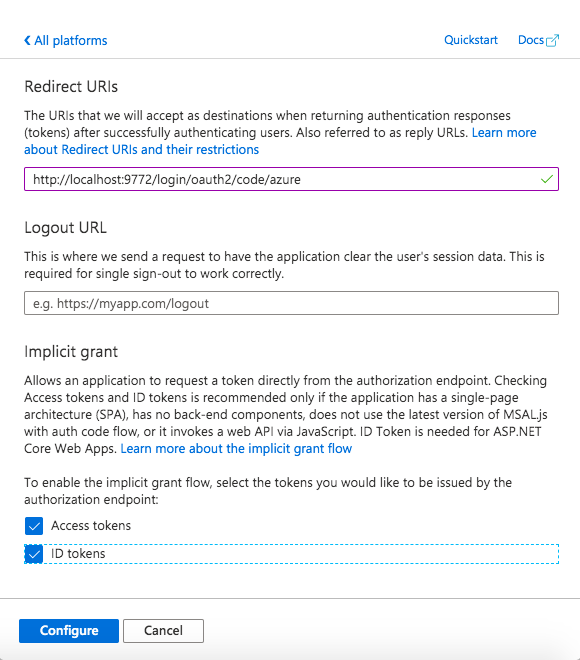
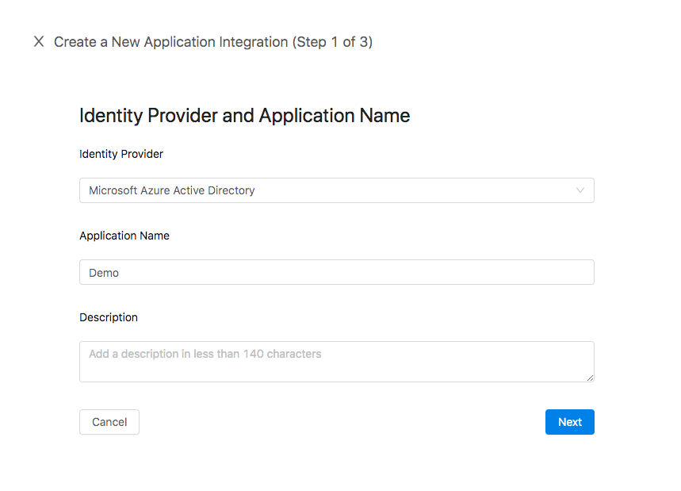

# How to secure our applications using the Datawiza Access Broker 

This tutorial will show you how to use the Datawiza Access Broker ([DAB](https://datawiza.com/access-broker)) to implement a Zero Trust architecture for your applications. We will deploy the DAB to proxy to a simple Flask application and will use **Microsoft Azure Active Directory** as our Identitiy Provider (IdP) to implement Single Sign on (SSO). The DAB provides a unified authentication and authorization layer which is decoupled from the application itself. It can be deployed both on-premise and on the cloud as a container. After deploying the DAB, we will also see how we can implement access control policies on a URL-level. 

---

## Why Zero Trust?
A Zero Trust architecture helps to prevent successful data breaches by eliminating the concept of "trust" from an organization completely. It relies on the notion that everything within an organization's network cannot be trusted (say, connections from a VPN to a company resource). Whenever a user wants access to a specific resource, we make sure we authenticate and verify every step of the way. 

### Datawiza Access Broker ([DAB](https://datawiza.com/access-broker)) benefits

The DAB provides us with the ability to:
* Enable SSO with an Identity Provider (Azure AD, Okta) automatically
* Enable remote work without using a Virtual Private Network
* Enable a fine-grained URL-level access control based on a user's attributes

---

## Architecture
The Datawiza Access Broker is an **identity-aware reverse proxy** that sits in front of our applications. Traffic reaches the DAB first, and is then proxied to our app if allowed by the access policies we have specified. The DAB is managed by a centralized, cloud-based console: Datawiza Cloud Management Console (DCMC). The DCMC allows us to manage and configure the access control policies of multiple Access Brokers--regardless of whether they are running on-premise or in the cloud. 


### Deployment
The DAB can be deployed in one of two modes:
1. Sidecar mode: DAB deployed on the same server as the application
2. Standalone mode: DAB deployed on a different server than the application

---

## Preview
After learning a bit more about the architecture and benefits of the Datawiza Access Broker, let's see it in action for ourselves. In this tutorial, we will use the DAB to enable both SSO and granular access control for a simple Flask application serving static HTML. The Identity Provider we will use is Azure Active Directory. 
* Our Flask application will run on our local `eth0` local interface. In this example, `192.168.0.80:3001`.
* The DAB will run on `localhost:9772`. The traffic to our app will reach the DAB first, and then be proxied to our application. 
* The docker image for both the DAB and sample Flask application will be provided.
 
---

## Part 0: Installing prerequisites
We deploy the DAB as we would any other reverse-proxy, such as NGINX. In this tutorial, we will use `docker-compose` to run the access broker. Let's take care of these prerequisites by installing them now. 

Let's first install docker. Refer [here](https://docs.docker.com/get-docker/) regarding operating systems specific instructions. In a Linux environment, we can run `wget -qO- https://test.docker.com/ | sh` to install our docker dependency. 

We will need this when we try to pull the docker image containing the DAB. 

Next, let's download docker-compose. Refer [here](https://docs.docker.com/compose/install/) for installation instructions. 

Finally, check that both installations were successful by doing:
```
docker --version
docker-compose --version
```
If both commands show version and build numbers, you are good to go!

## Part 1: A quick look at our Flask App
Our Flask app is serving static HTML. To see what the page looks like, first source the virtual environment:
```
`cd flask_app`
`source blog-venv/bin/activate`
```

Then, run the application: `./app`.
> When visiting `http://192.168.0.80:3001`, you should see the following image:


Eventually, once we set up the DAB to proxy to our app, we will be able to access our Flask application when visiting `http://localhost:9772`, where we should be prompted to sign with our Identity Provider (Azure Active Directory in this case).

--- 

## Part 2: Configure Microsoft [Azure Active Directory](https://azure.microsoft.com/en-us/services/active-directory/)
We have to register an OIDC Web application on the Microsoft Azure AD portal. The three values we get from our configuration (**Tenant ID**, **Application (client) ID**, **Client Secret**) will be used for later configuration in the Datawiza Cloud Management Console (DCMC). 

### Obtain Tenant ID
1. After registering for an account on Microsoft Azure, navigate to the Azure Active Directory tab in the menu. 
> Make sure to save the **Tenant ID** on your Azure AD overview portal located in the `Tenant Information` box. 


### Register our app in Azure
2. Select `App Registrations` from the side bar and select `+ New registration`. Create an `Application` with the following fields:
* Name: e.g., Demo
* Supported account types: Accounts in this organizational directory only (Single tenant)
* Leave other fields as their default values
* Click `Register`

> Make sure to save the **Application (client) ID** after successfully registering your Application.


3. Making sure we are now in the application we have just created and are no longer in our `Default Directory`, select `Certificates & secrets` from the side bar. Create a new client secret by selecting `+ New client secret`. 
* Specify a name for the `client secret`
* Make the default 1 year

> Make sure to save the **Client Secret** after successfully creating a new client secret.


4. While staying in the `Demo` application we created, select `API permissions` from the side bar. `User.Read` should already be configured by default. Find and add `Group.Read.All` permissions under: `Add a permission` -> `Microsoft Graph` -> `Delegated Permissions` -> `Group` -> `Group.Read.All`. 
* After adding `User.Read` and `Group.Read.All`, make sure both permissions are "granted" for your directory. You can specify this option by selecting the `Grant admin consent for Default Directory` button. 


5. Select `Authentication` from the side bar. `+ Add a platform`, and select `Web` under `Web Application`. 

6. Configure `Web` with the following values:
* Redirect URLs: `http://localhost:9772/login/oauth2/code/azure`
* You can leave `Logout URL` with its default value
* Make sure both `Access tokens` and `ID tokens` are allowed underneath `Implicit grant`



7. Within your application, head over to the `Manifest` tab from the side bar. Ensure that the following values are both set to true:
* `oauth2AllowIdTokenImplicitFlow: true`
* `oauth2AllowImplicitFlow: true`

--- 

## Part 3: Configure the Datawiza Cloud Management Console ([DCMC](https://console.datawiza.com/login))
Just like how we created an application on Azure AD, we need to create an application along with a keypair (`API key`, `API secret`) on the DCMC. This keypair is used in order for the Datawiza Access Broker to get the latest configurations and policies from the Datawiza Cloud Management Console. 

### Sign In
1. Log into the [DCMC](https://console.datawiza.com/login) with your credentials. If you need a username and password, please contact **info@datawiza.com**. 

### Create an application
2. Welcome to the DCMC homepage! Let's get started! Select the `Get started` button in the upper-right corner to create a new application integration. Create an integration with the following fields:
* Identity Provider: Microsoft Azure Active Directory
* Application Name: e.g, Demo



3. Select `Web` as the platform option.

### Configure app settings
4. Configure the applications settings with the following values:
* `Public Domain`: `http://localhost:9772`. Make sure to use `http` instead of `https`. 
* Copy and paste the previous saved values from the Azure AD configuration (Part 1) for the **Application (client) ID**, **Client Secret**, and **Tenant ID**
* `Upstream Server`: (see below)
    * Is the address of the application that you want to enable SSO for
    * If you are using the DAB in sidecar mode and the Flask application is running on `http://192.168.0.80:3001`, set the upstream server to `http://192.168.0.80:3001` (address of our Flask app). 
* Then select `Create`


### Generate API keypair on DCMC
1. Return to the `Application` tab and select `API Token` to generate a keypair. Select `Create API Key`. 
    * Give your API Key a name
    * Select the expiry time to be `1 month later`
2. Make a note of your newly created keypair (**API Key**, **API Secret**). This will be needed when we run the DAB. 


---

## Part 4: Run Datawiza Access Broker with our Flask App
After setting up our configuration with Azure AD and the DCMC, we are finally ready to deploy the DAB alongside our Flask application and implement granular access control. Make sure you have installed the dependencies mentioned in Part 0. 

Create the following file named `docker-compose.yml`:
```
version: '3'

services:
  datawiza-access-broker:
    image:registry.gitlab.com/datawiza/access-broker:1.2.6
    container_name: datawiza-access-broker
    restart: always
    ports:
      -"9772:9772"
    environment:
      MGMT_API_KEY: replace-with-API-Key-from-DCMC
      MGMT_API_SECRET: replace-with-API-Secret-from-DCMC
      CONNECTOR_NAME: aad
```

After creating `docker-compose.yml`, run `docker login registry.gitlab.com -u datawiza-deploy-token -p ######` to login to the container registry. If you don't have the deploy token, make sure to contact **info@datawizacom**.

Now, run `docker-compose -f docker-compose.yml up` (making sure you are in the same directory as your .yml file). 

If everything looks good, you should be all set with the DAB.

### Things to keep in mind:
* Make sure your `docker-compose.yml` file does not contain any tabs. They arent allowed in [YAML](https://yaml.org/faq.html)
* If you get the following error when running `docker-compose`:
```
Got permission denied while trying to connect to the Docker daemon socket at unix:///var/run/docker.sock: Get http://%2Fvar%2Frun%2Fdocker.sock/v1.40/containers/json: dial unix /var/run/docker.sock: connect: permission denied
```
you will need to add your current user to the docker group using the `groupadd` and `usermod` commands. Follow the instructions [here](https://www.digitalocean.com/community/questions/how-to-fix-docker-got-permission-denied-while-trying-to-connect-to-the-docker-daemon-socket).

* `CONNECTOR_NAME` specifies the Identity Provider you configured in Step 1. 
    * `aad` -> Azure Active Directory
    * `okta.oidc` -> Okta
* `"9772:9772"` maps the docker host's port `9772` to the container's port `9772`. 

## Visiting localhost:9772

---


Kirk part of Federation group
At end, have a member of klingon group try to access transporter
